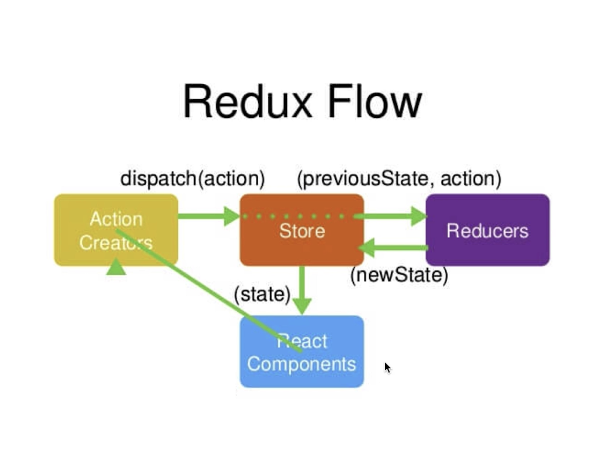
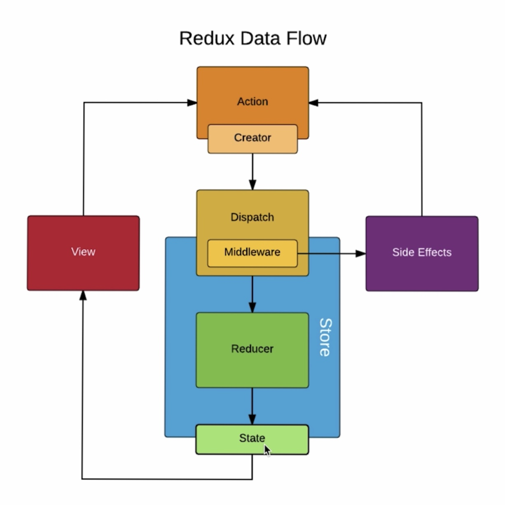

# React Demo
*By Malcolm Ma*

## 知识点汇总

### 1. React 生命周期函数
生命周期函数指在某一个时刻组件会自动调用执行的函数

#### (1) componentWillMount()
在组件即将被挂载到页面的时刻，自动被执行

#### (2) componentDidMount()
组件被挂载到页面之后，自动被执行

#### (3) shouldComponentUpdate()
组件被更新之前，自动被执行

返回 **True/False**

#### (4) componentWillUpdate()
组件被更新之前，它会自动执行，但是他在shouldComponentUpdate()之后。
如果shouldComponentUpdate()返回true，他才执行；
如果返回false，不会被执行

#### (5) componentDidUpdate()
组件更新完成之后，它会被执行

#### (6) componentWillRecieveProps()
当一个组件从父组件接受了参数，
如果这个组件第一次存在于父组件中，不会执行；
如果这个组件之前已经存在于父组件中，才会执行

#### (7) componentWillUnmount()
当这个组件即将被从页面中剔除的时候，才会执行

### 2. Redux
#### (1) Redux Flow

#### (2) Redux Middleware

